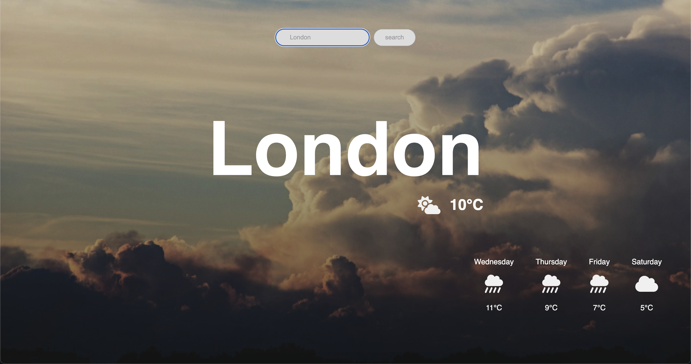

## A weather application aimed at providing users with accurate and up-to-date weather forecasts.

Website: 

Overview: Thunderish is a clean and simple weather app that uses the Open-Meteo weather API (https://open-meteo.com/) and the Geoapify places API (https://www.geoapify.com/) to facilitate lookup of the current weather and 5-day forecast for a search location.

Inspiration: The Weather Channel, AccuWeather, Weather Underground

Objectives:

- Develop a responsive web application for displaying weather data.
- Implement integration with a weather data API to fetch forecast information.
- Design an easy-to-navigate user interface that presents weather information clearly.

## Screenshots





## Installation and Setup

1. **Clone the repository**:

   ```bash
   git clone https://github.com/MaxB-Coder/news-summary.git
   cd news-summary
   ```

2. **Install dependencies**:

   ```bash
    npm install
   ```

3. **Run the Server**:

   ```bash
    npm run dev
   ```

Visit the local host server that is in your console to view the project!

### Prerequisites

- Git
- Node.js

### Technologies

- React (Vite)
- Axios
- Vitest

## Acknowledgements

- Open-Meteo and Geoapify for the APIs.
